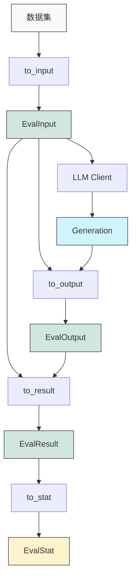

# LLM Evaluation Suite

灵活、可组合、可扩展的 LLM 评估组件

> 可能是你见过的最现代的 LLM 评估框架 😋

## 动机 & 优势

现有的 LLM 评估框架添加了很多限制。

我们观察到几个关键事实：

- 评估框架碎片化，许多 Benchmark 工作都附带一个低质量的评估代码；
- 存在许多"隐式"的内容，难以使用或修改；
- 缺乏合理的可扩展设计，导致很多时候必须等待上游支持才能实现新的评估任务/数据集；
- 过度追求"仅通过配置即可使用"，导致大量逻辑被迫以配置的方式实现；
- 难以与现有的 LLM 生态结合；

针对这些问题，我们重新设计了一个 LLM 评估框架，旨在提供更好的灵活性和可扩展性。核心优势包括：

- 完整的灵活性：支持自定义评估任务、模型、评估指标、统计结果等；
- 可扩展：通过合理的设计抽象，你也可以轻松支持新的评估任务/数据集，而无须等待上游支持；
- 支持多种模型：支持 `OpenAI` 兼容服务器，`SGLang` 离线/在线/基础接口，`vLLM` 离线/在线接口等；
- 全面的评估体验优化：支持评估结果的缓存、请求自动重试等功能，最大限度地提升评估的效率和稳定性；

**框架的设计基于组合优于继承理念**：评估框架的各部分解耦，不会强求你使用别扭的配置参数来实现一些本应很容易实现的功能，如评测前的数据集过滤、分级等。用正确的方式实现正确的功能，最终组合在一起形成完整的评估流程。

## 设计思路

我们将模型评估过程抽象为：**针对数据集中的每个样本执行多次生成和评估；将评估结果进行聚合，得到最终的总体评估结果**。

> 所以，如果你不认同如上的评估思路，或者你想要实现更复杂的评估过程，那么或许本框架并不是最适合你的选择。

在eval-suite中，每种评测方式提供的并非是端到端的、不透明的函数，而是若干有机结合的组件。用户可以使用这些组件轻松地搭建起评估Benchmark，也可以根据需要替换或修改某些组件，而不必重写整个评估流程。这种方式给予了最大的灵活性，使得不同的评估需求都能以一种清晰、可维护的方式实现。

因此，我们按照评估阶段制定了如下接口：

生成与处理过程：

- `to_input(data) -> EvalInput`：将数据集中的数据项转换为评估的输入。
- `to_output(generation, input) -> EvalOutput`：将模型生成的结果转换为评估的输出。
- `to_result(eval_path, input, output) -> EvalResult`：将评估的输出转换为评估的结果。
- `to_stat(result_groups) -> EvalStat`：将评估的结果转换为统计信息。

以下是完整评估流程的示意图：



如图所示，评估框架的处理流程如下：

1. 从数据集中获取原始数据，通过 `to_input` 转换为结构化的 `EvalInput`
2. 将 `EvalInput` 发送给 LLM 客户端生成内容
3. 将生成的内容与输入一起通过 `to_output` 转换为 `EvalOutput`
4. 对输出进行评估，通过 `to_result` 转换为评估结果 `EvalResult`
5. 最后，汇总所有评估结果，通过 `to_stat` 生成最终的统计报告 `EvalStat`

## 例子：在 HumanEval 数据集上评估 Pass@k 指标

<!-- TODO 说明：使用评估组件搭建各类Benchmark都很容易；此处我们实现一个常用的Pass@k Benchmark来展示实现流程 -->

详见 [完整的例子](examples/humaneval.py)。

### 第一步：构造评估输入 `EvalInput`

构造评估输入是评估过程的起点，它决定了我们将如何处理数据集中的原始数据。在这一步中，我们需要：

1. 定义一个继承自`EvalInputBase`的类，用于存储评估所需的所有输入数据
2. 实现必要的两个方法：`input_id`和`__str__`

`input_id`方法返回评估输入的唯一标识符，框架使用它来跟踪评估过程中的每个样本。通常它会直接对应数据集中的 ID 字段，如果数据集没有 ID 字段，你也可以通过哈希输入内容来创建一个唯一标识符。

`__str__`方法则定义了如何将输入转换为发送给 LLM 的提示文本。这个方法的实现非常灵活，你可以：

- 直接返回原始提示
- 使用格式化字符串构建更复杂的提示
- 利用 Jinja2 模板系统创建结构化提示
- 添加少样本示例、系统提示等

以下是一个更完整的例子，展示了如何利用模板和数据集字段构建有效的评估输入：

```python
class EvalInput(EvalInputBase):
    task_id: str
    prompt: str
    canonical_solution: str
    test: str
    entry_point: str

    @property
    def input_id(self) -> str:
        return self.task_id

    def __str__(self) -> str:
        # 使用加载的模板来渲染提示
        return eval_template.render(
            prompt=self.prompt,
            # 可以添加少样本示例
            shots=[
                "示例问题1\n示例解答1",
                "示例问题2\n示例解答2"
            ]
        )
```

实现`to_input`方法时，我们通常直接使用 Pydantic 的模型验证功能将原始数据转换为我们定义的`EvalInput`类型（这也是该方法的默认实现）：

```python
def to_input(self, data: Any) -> EvalInput:
    # 直接验证数据并转换为EvalInput
    input = EvalInput.model_validate(data)

    # 如果需要，可以在这里对输入进行额外处理
    # 例如格式化、清理或增强输入数据

    return input
```

### 第二步：根据模型生成结果构造 `EvalOutput`

`to_output`方法的目的是将模型生成的原始文本转换为更结构化的评估输出对象。在代码生成类任务中，这通常涉及从生成文本中提取出代码部分；在问答类任务中，可能需要提取模型回答的核心内容。

这一步骤的关键点包括：

1. **结构化提取**：从生成内容中提取有用信息，框架提供了工具如`extract_code`帮助你从文本中提取特定语言的代码块
2. **数据验证**：确保提取的内容满足评估需求，如果发现问题可以抛出异常使框架重新采样
3. **格式转换**：将内容转换为适合后续评估的格式

例如，在代码生成任务中，你可能需要从模型回复中提取出代码部分：

```python
def to_output(self, generation: Message, input: EvalInput) -> passk.EvalOutput:
    # 使用工具类提取代码，可以指定语言和标识符
    result = extract_code(generation.content).get("python", id="solution")

    if not result:
        # 如果没有找到符合条件的代码块，尝试提取第一个Python代码块
        results = extract_code(generation.content).get("python")
        if results:
            code = results[0].code
        else:
            # 如果依然没有找到代码块，抛出异常
            raise ValueError("No code found in the generation")
    else:
        code = result.code

    return passk.EvalOutput(code=code)
```

更复杂的处理可能涉及代码清理、格式化或预处理，以确保代码可以正确执行：

```python
def to_output(self, generation: Message, input: EvalInput) -> passk.EvalOutput:
    code = extract_code(generation.content).get("python", id="solution")

    # 清理代码，移除不必要的注释或装饰性内容
    code_clean = clean_code(code)

    # 添加必要的导入语句
    if "numpy" in code_clean and "import numpy" not in code_clean:
        code_clean = "import numpy as np\n" + code_clean

    return passk.EvalOutput(code=code_clean)
```

### 第三步：对模型输出进行评估，得到 `EvalResult`

`to_result`方法是评估过程中最核心的部分，它负责对模型生成的输出进行评估，并生成评估结果。根据评估任务的不同，这一步可能涉及：

- 执行生成的代码并检查其功能性
- 比较生成的答案与标准答案
- 调用外部 API 或工具进行评分
- 使用另一个 LLM 作为裁判来评价内容质量

在代码评估场景中，我们通常需要将生成的代码保存到文件、添加测试代码，然后执行并检查结果：

```python
async def to_result_async(
    self,
    eval_path: Path,
    input: EvalInput,
    output: passk.EvalOutput,
) -> passk.EvalResult:
    _ = await Command.python(code=output.code, cwd=eval_path).run(
        exc=EvalException(type=ResultType.functional_error),
    )

    return passk.EvalResult(passed=True)
```

框架提供了多种实现评估逻辑的方式，针对不同的评估特性，具体介绍请参见[根据特性选择合适的评估过程实现](#根据特性选择合适的评估过程实现)。

### 第四步：对评估结果进行聚合，得到 `EvalStat`

在收集完所有评估结果后，最后一步是将这些结果聚合成有意义的统计数据。这一步通过实现`to_stat`方法或使用框架提供的默认实现来完成。统计过程主要涉及：

1. **数据分组**：将评估结果按照输入 ID 分组，以便计算每个样本的统计信息
2. **指标计算**：根据评估任务的需求计算相关指标，如 Pass@k、平均分数、准确率等
3. **结果格式化**：将计算结果组织成结构化的`EvalStat`对象，便于后续展示和分析

以 Pass@k 评估为例，统计实现可能如下：

```python
class PassKBenchmark(...):
    @staticmethod
    def stat(ctx: StatContext) -> EvalStat:
        return EvalStat.init(groups=ctx.groups, k=ctx.config.k)
```

对于每一种评估方式，我们都会预期看到一些特定的统计数据，比如 Pass@k 评估中我们希望看到 `pass@1`、`pass@10` 等等。这些默认的统计数据将会以 `EvalStat` 的形式实现。如果你无须额外的统计数据，那么可以直接使用 `EvalStat` 的默认实现。

你可以根据评估任务的需求自定义`EvalStat`类，添加或删除相关字段。框架提供了多种统计基类，帮助你快速实现常见统计需求。

### 通用统计

框架在 `eval_suite/benchmark/stat` 目录下提供了一些通用的统计类型，以简化常见的统计需求：

1. **基础统计 `BaseEvalStat`**：提供了基本的评估统计信息，如样本总数、输入总数以及各类结果的统计（包括成功、失败、超时等）。

```python
class BaseEvalStat(BaseModel):
    total_samples: int     # 评估的样本总数
    total_inputs: int      # 评估的输入总数
    results: ResultStat    # 各类结果的统计信息

    @classmethod
    def from_groups(cls, groups: EvalResultGroups) -> Self:
        # 计算统计信息的实现
        ...
```

使用这些通用统计类，你可以快速实现自己的统计需求，同时保持结果格式的一致性。在创建自定义评估任务时，可以直接使用这些统计类，或者根据需要组合它们，如前面示例中的组合方式：

```python
class EvalStat(BaseModel):
    base: BaseEvalStat    # 基础统计信息
    k: int                # k值设置
    passk: PassKStat      # Pass@k统计信息

    @classmethod
    def from_groups(cls, groups: EvalResultGroups[EvalResult], k: int) -> Self:
        base = BaseEvalStat.from_groups(groups=groups)
        passk = PassKStat.from_groups(k=k, groups=groups)

        return cls(base=base, k=k, passk=passk)
```

通过在模型中包含其他统计结果类型的字段，我们可以轻松地组合多种统计方法，同时保持代码的清晰和可维护性。每个子统计结果负责计算自己关心的指标，最终组合成一个完整的统计报告。

对于所有统计类型，我们通常会实现一个 `from_groups` 类方法，它接收所有评估结果组，并返回计算好的统计信息。这种设计使得统计逻辑与评估逻辑分离，便于独立维护和扩展。

### 让 LLM 帮你统计

对于复杂的统计需求，特别是那些难以用简单代码表达的分析，我们提供了一个特殊的统计类 `AutoStat`，它可以利用 LLM 来自动分析评估结果：

```python
class AutoStat(BaseModel):
    """使用LLM自动生成评估结果统计"""

    stat: Any  # 存储LLM生成的统计结果

    @classmethod
    def from_groups(
        cls,
        model: str,                  # 使用的LLM模型名称
        groups: EvalResultGroups, # 评估结果分组
        *,
        requirement: str = "分析给定的数据并返回结果。", # 分析要求
        api_key: SecretStr | None = None,    # API密钥
        base_url: str | None = None,        # API基础URL
    ) -> Self:
        # 实现调用LLM进行分析的逻辑
        ...
```

使用这种方式，你可以用自然语言描述你想要的分析，让 LLM 为你处理复杂的统计工作。例如你可以要求：

- "分析模型在不同类型问题上的表现差异"
- "找出模型最常犯的错误类型并分类"
- "对比多个模型在相同任务上的表现并提供直观解释"

这种方法特别适合于探索性分析或需要更人性化解释的评估场景。

## 根据特性选择合适的评估过程实现

- `to_result`：可独立执行的计算密集型任务，如对生成文本进行词频统计。忽略 `eval_batch_size`，而使用与 CPU 数量相同的进程来执行评估任务。
- `to_result_async`：可独立执行的 IO 密集型任务，如调用外部 API 获取评估结果。通过 `eval_batch_size` 来控制并发的评估任务数量。
- `to_result_batch`：批量执行的计算密集型任务，如对生成文本进行批量分词。不是很常用，大多数情况下实现 `to_result` 即可。
- `to_result_batch_async`：批量执行的 IO 密集型任务，如调用 LLM 批量对生成内容进行评分。通常用于处理外部 API 自带批量处理的情况。

## 加载 Benchmark 的临时资源，如输出路径

Benchmark 类被设计为可以在 `with` 上下文管理器中使用，这使得它能够在评估开始前自动准备临时资源，并在评估结束后自动清理：

```python
with MyBenchmark(...) as benchmark:
    # 在这个块内，benchmark 已自动准备好所需的临时资源
    result = await benchmark.run(client)
# 出了这个块，临时资源会被自动清理
```

你可以通过两种方式管理评估输出路径：

1. **手动指定 `base_path`**：如果你希望将评估结果保存到特定位置，可以在创建 Benchmark 实例时指定 `base_path` 参数：

```python
benchmark = MyBenchmark(
    name="my-benchmark",
    dataset=dataset,
    base_path=Path("/path/to/save/results"),
)

# 此时不必使用 with 语句也可以正常工作（但仍然推荐使用）
result = await benchmark.run(client)
```

2. **使用临时目录**：如果你不指定 `base_path`，则必须在 `with` 语句中使用 Benchmark，框架会自动创建一个临时目录来存储评估结果，并在评估结束后自动清理：

```python
with MyBenchmark(name="my-benchmark", dataset=dataset) as benchmark:
    result = await benchmark.run(client)
# 临时目录会在这里被清理
```

使用临时目录特别适合于单次运行的评估任务，而手动指定路径则适合于需要长期保存结果或多次对比的场景。

## Benchmark 配置

Benchmark 的配置可以通过`BaseEvalConfig`类进行设置。以下是所有可用的配置项，这些配置直接影响评估的行为和结果保存方式：

| 配置项            | 类型         | 默认值                 | 描述                                                                                       |
| ----------------- | ------------ | ---------------------- | ------------------------------------------------------------------------------------------ |
| `stat_file`       | `Path`       | `Path("stat.json")`    | 相对 json 文件路径，用于保存评估统计结果，也用于判断评估是否已完成                         |
| `results_file`    | `Path\|None` | `Path("results.json")` | 相对 json 文件路径，用于保存评估详细结果                                                   |
| `overwrite`       | `bool`       | `False`                | 当`stat_file`已存在时，是否覆盖现有评估结果                                                |
| `use_cache`       | `bool`       | `True`                 | 是否使用缓存的评估数据                                                                     |
| `n_samples`       | `int`        | `1`                    | 每个样本的生成次数                                                                         |
| `max_n_samples`   | `int\|None`  | `n_samples * 2`        | 每个样本最大的生成次数，直到至少获得`n_samples`个有效结果为止。`None`表示没有限制          |
| `system_prompt`   | `str\|None`  | `None`                 | 评估时使用的系统提示                                                                       |
| `eval_batch_size` | `int`        | `os.cpu_count()`       | 评估过程的批处理大小，表示并行评估的样本数。对于 IO 密集型评估，可以设置更高的值以提高性能 |
| `overlap`         | `bool`       | `True`                 | 是否重叠生成和评估过程。如果生成和评估使用相同资源（如 GPU），可设为`False`以避免资源竞争  |

这些配置项可以在创建 Benchmark 实例时进行设置：

```python
benchmark = MyBenchmark(
    name="my-benchmark",
    dataset=dataset,
    config=BaseEvalConfig(
        n_samples=10,
        max_n_samples=20,
        system_prompt="你是一个专业的代码生成助手",
        eval_batch_size=32,
        overlap=False,
    ),
)
```

对于特定类型的评估，可能会有额外的配置选项。例如，Pass@k 评估还需要设置 k 值：

```python
benchmark = HumanEvalBenchmark(
    name="human-eval",
    dataset=dataset,
    config=passk.EvalConfig(
        k=5,  # Pass@k评估特有的配置
        n_samples=100,
    ),
)
```

## 缓存评估结果

调用商业模型的 API 接口可能会产生很高的费用，所以通常而言你会希望即使评估过程出现了错误，也能保留已经完成的生成/评估结果。为此，我们提供了一个简单的缓存机制。

<!-- TODO 介绍缓存机制 -->

## 异常处理

对于大多数情况，异常并不是我们想要的，我们希望能够获得有效的评估结果用于统计。因此框架将会对抛出异常的评估过程重新进行评估，直到获得足够多有效的评估结果（或到达 `max_n_samples` 限制，见 [Benchmark 配置](#benchmark-配置)）。如果你希望在评估过程中抛出异常，可以使用 `raise EvalException` 来实现。

但在某些评估中，出现异常也是一种预期的评估结果，如 Pass@k 评估中，执行代码的进程失败代表生成结果没有通过测试，这是预期的。对于这种情况，我们可以为实现 `EvalResultBase.from_exception` 方法，从异常中创建评估结果：

```python
class EvalResult(EvalResultBase):
    @classmethod
    def from_exception(cls, exc: EvalException) -> EvalResult:
        # 继续抛出未知异常，避免掩盖非预期行为
        if exc.type == BaseEvalResultType.fail:
            raise exc

        # 预期异常，返回评估结果
        return cls(
            passed=False,
            exception=exc,
        )
```

## 构建新的 Benchmark

<!-- TODO -->

## 性能优化提示

<!-- TOOD -->

- 根据你的硬件资源合理地设置评估参数。
- `to_input`, `to_output` 会被多次调用，因此应该是一个轻量的、幂等的函数。

## 执行外部命令

LLM 评估中经常需要执行外部命令（如编译、运行代码等）来获得评估结果。为此，框架提供了灵活的 Command 机制，便于你安全、优雅地集成外部命令行工具。

### 设计自定义 Command 类

你可以通过继承 `CommandBase`，为你的评测场景封装常用的外部命令。例如，下面是一个用于 Verilog 代码评测的 Command 类：

```python
from eval_suite.command import CommandBase, Process

class Command(CommandBase):
    @classmethod
    def verilog_compile(
        cls,
        *code_paths: Path,
        cwd: Path | None = None,
        output_path: Path = Path("simv"),
        **kwargs,
    ) -> Process:
        return cls.docker_run(
            "iverilog",
            "-o",
            str(output_path),
            *(str(path) for path in code_paths),
            container="icarus-verilog",
            cwd=cwd,
            **kwargs,
        )

    @classmethod
    def verilog_simulate(
        cls,
        output_path: Path = Path("simv"),
        cwd: Path | None = None,
        **kwargs,
    ) -> Process:
        return cls.docker_run(
            "vvp",
            str(output_path),
            container="icarus-verilog",
            cwd=cwd,
            **kwargs,
        )
```

### 在 Benchmark 中调用外部命令

在评测流程中，你可以直接调用自定义的 Command 方法，并通过 `run()` 方法异步执行命令。例如：

```python
await Command.verilog_compile(
    design_path,
    testbench_path,
    cwd=eval_path,
    output_path=output_path,
).run(exc=EvalException(type=ResultType.compile_error))

await Command.verilog_simulate(
    output_path=output_path,
    cwd=eval_path,
).run(exc=EvalException(type=ResultType.simulation_error))
```

- `run()` 方法支持超时控制（默认 60 秒），并自动捕获异常。
- 你可以通过传递自定义的 `EvalException`，为不同类型的错误指定不同的异常类型，便于后续统计和分析。

### 支持 Docker 环境

`CommandBase` 支持在本地或 Docker 容器中运行命令。你可以使用 `docker_run` 或 `docker_exec` 方法，指定镜像或容器名称，实现隔离、安全的评测环境。

- `docker_run`：在新建的容器中运行命令，适合一次性任务。
- `docker_exec`：在已存在的容器中执行命令，适合复用长时间运行的环境。

### 典型用法总结

1. 继承 `CommandBase`，实现你的外部命令方法。
2. 在评测流程中调用这些方法，并用 `run()` 执行，获取结果或捕获异常。
3. 利用异常类型区分编译错误、运行错误等，便于统计。

更多完整例子可参考 [`examples/verilogeval.py`](examples/verilogeval.py)。

## 模型 Client

<!-- TODO -->

### Client 配置

<!-- TODO -->

### (OpenAI) 管理 Docker 容器的生命周期

在初始化 `OpenAIClient` 时，可以选择性地指定一个 `docker_container_id` 参数。这样就可以管理用于评估的 Docker 容器的生命周期。容器将在 Client 初始化时启动，并在 Client 关闭时停止。

```python
from lm_eval.client import OpenAIClient

with OpenAIClient(
    # ...
    docker_container_id="my_container",
) as client:
    # ✅ Docker 容器将在 Client 初始化时启动
    _ = client.generate( ... )
# ✅ Docker 容器将在 Client 关闭时自动停止
```

Tips: 我们知道，启动 Docker 容器后，可能会有一些时间需要等待容器完全启动。因此在 Client 初始化时会调用名为 `wait_for_openai_server` 的函数，重复请求 `/models` 接口，直到模型列表中包含 Client 指定的模型为止。

### (SGLang) 延迟初始化

SGLang `Engine` 在创建时会自动初始化模型，这可能需要一些时间。因此我们将初始化延迟到第一次调用 `generate` 时，而不是在进入 `with` 块时进行初始化。

```python
from lm_eval.client import SGLangClient

model = SGLangClient( ... )

with model as client:
    # ✅ 此时没有调用 `generate`，所以模型不会被初始化
    if not do_some_check():
        return

    # ✅ 此时调用 `generate`，所以模型会被初始化
    _ = client.generate( ... )
```

### (SGLang) `<think>` 标签补全

许多推理模型使用添加 `<think>` 标签到生成提示的技巧来强制模型思考。然而这可能会破坏推理解析。因此我们应用一个简单的技巧：当响应中有 `</think>` 标签时，我们会尝试在开头添加 `<think>` 标签。

## 工具类

<!-- TODO -->

### 提取生成结果

````python
result = extract_code(code)

code = """
```python
# code block a
```

```python {single}
# code block b
```

```python [grouped] {a}
# code block c
```

```python [grouped] {b}
# code block d
```

```scala
// code block e
```
"""

all_codes: list[str] = result.get('python') # for all blocks marked with python
assert all_codes == ["# code block a", "# code block b", "# code block c", "# code block d"]

single_code: str = result.get('python', id='single') # python and <single>
assert single_code == "# code block b"

grouped_codes: list[str] = result.get('python', group='grouped') # python and [grouped]
assert grouped_codes == ["# code block c", "# code block d"]

code_inside_group: str = result.get('python', group='grouped', id='b') # python and [grouped] and <c>
assert code_inside_group == "# code block d"
````

### 加载 Jinja2 模板

Jinja2 模板是维护 prompt 的一种很好的方式。我们提供了一个简单的工具类来加载 Jinja2 模板，随后你可以将其渲染为字符串，作为模型的 prompt：

```python
from lm_eval.utils.template import load_template
import curr_module

# curr_module.template.some_template.j2 将会被加载
template = load_template(curr_module, "some_template")
prompt = template.render(
    # 传入模板变量
    var1="value1",
    var2="value2",
)
```

### 加载 Huggingface 数据集

是的，我们都爱 `datasets`，但它对于 type hinting 的支持实在是太差了：

```python
from datasets import load_dataset

dataset = load_dataset("human_eval", split="test")
# dataset: DatasetDict | Dataset | IterableDatasetDict | IterableDataset 😅
```

为了增强类型提示支持，当你明确知道你要加载的数据类型确实是 `datasets.Dataset` 时，可以使用 `lm_eval.utils.dataset.load_dataset` 函数来加载数据集。该函数会自动推断数据集的类型，并返回一个 `datasets.Dataset` 对象。

```python
from lm_eval.utils.dataset import load_dataset

dataset = load_dataset("human_eval", split="test") # load from repo_id
dataset = load_dataset(Path("path/to/dataset")) # load from local disk
# dataset: Dataset
```
